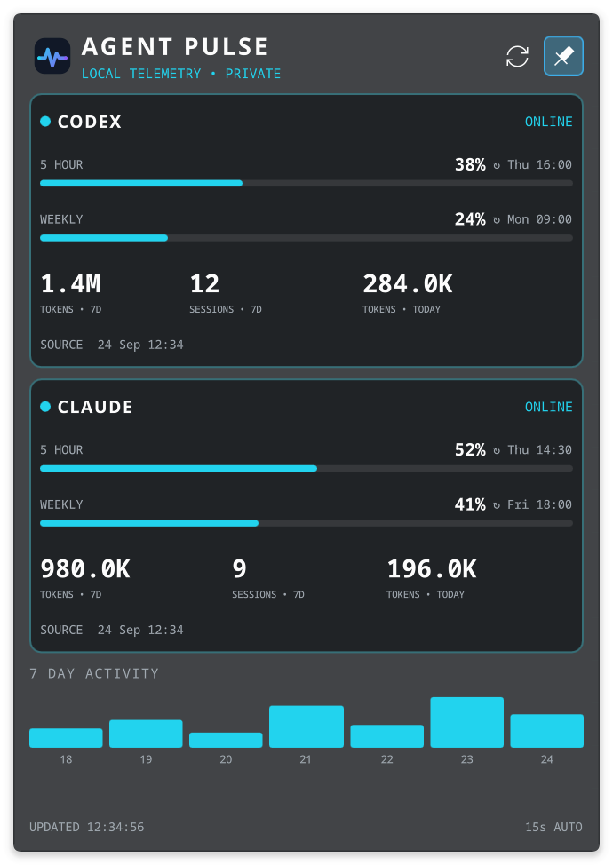

# Agent Pulse

A native Plasma 6 widget for private, at-a-glance Codex and Claude Code activity. Agent Pulse turns the local history those tools already keep into a restrained desktop dashboard—without uploading prompts, source code, or credentials.

  



## What it shows

- Codex and Claude tokens today and over the last seven days
- Seven-day session counts and a combined activity chart
- Source freshness, last refresh, and auto-refresh cadence
- Server-reported Codex and Claude usage windows with percentages and reset times, when available
- System, light, and dark appearances with Cyan, Violet, Amber, Nord, and Solarized accents
- Full desktop dashboard plus a compact taskbar icon with a click-open popup
- Pin control to keep the taskbar popup open while working elsewhere

## Install on Plasma 6

Install `agent-pulse.plasmoid` from the [latest release](https://github.com/xiahongze/agent-pulse/releases) with Plasma's **Install New Widgets > Install from Local File**, then search for **Agent Pulse** in the widget picker and add it to the desktop or panel. Plasma 6, its Plasma5Support executable engine, and Python 3.11+ are required. There is no service, port, or separate backend setup.

To install from a checkout:

```bash
git clone https://github.com/xiahongze/agent-pulse.git
cd agent-pulse
./scripts/install.sh
```

The widget runs its bundled Python collector when it refreshes. Refresh interval, appearance, and Claude online usage are available in widget settings. Optional custom history locations can be set in `~/.config/agent-pulse/config.json` using [config.example.json](config.example.json).

## Data accuracy and privacy

The top-level non-interactive commands do not directly print quota, but Codex records server-reported rate-limit snapshots in its local session events. Agent Pulse shows those 5-hour/weekly percentages and reset times, plus local history:

- Codex: rate windows from recent `token_count` events and aggregate history from `~/.codex/state_5.sqlite`
- Claude: aggregate daily model-token and activity values from `~/.claude/stats-cache.json`

For OAuth-based Claude accounts, Agent Pulse reads the access token from `.credentials.json` and sends it to Anthropic's HTTPS `/api/oauth/usage` endpoint. This undocumented endpoint supplies the 5-hour, weekly, and any model-scoped windows when available. The token is never printed, logged, or stored elsewhere. Disable **Fetch online rate windows** in widget settings to keep collection fully offline; history continues to work.

Successful Claude usage windows are cached locally for five minutes so each widget refresh does not call Anthropic again. The cache contains only displayed percentages and reset times, never credentials. The Claude card shows the local history date and the last successful API fetch date and time separately. If Anthropic rate limits a request, Agent Pulse keeps the last available windows and their fetch time while spacing out retries.

The collector extracts usage fields from local history without retaining prompts, responses, tool calls, or source content. It prints one JSON snapshot to the widget and exits. Upstream file schemas are not public contracts, so unavailable or changed data is omitted rather than guessed.

## Develop and package

```bash
make test
make lint
make package
```

The release artifact is `dist/agent-pulse.plasmoid`, including the collector. The project uses a native QML/Kirigami frontend and a Python standard-library collector. Plasma's executable data engine is part of the Plasma5Support compatibility layer and may require a future replacement.

## Upgrading from a service-based release

The new widget does not use the old user service. After installing the new plasmoid, remove the earlier service once:

```bash
systemctl --user disable --now agent-pulse.service
rm ~/.config/systemd/user/agent-pulse.service ~/.local/share/agent-pulse/agent_pulse.py
systemctl --user daemon-reload
```

The old configuration file can remain if it contains custom history locations; the collector ignores its retired host, port, and binary settings.

## Uninstall

```bash
kpackagetool6 --type Plasma/Applet --remove io.github.xiahongze.agentpulse
```
